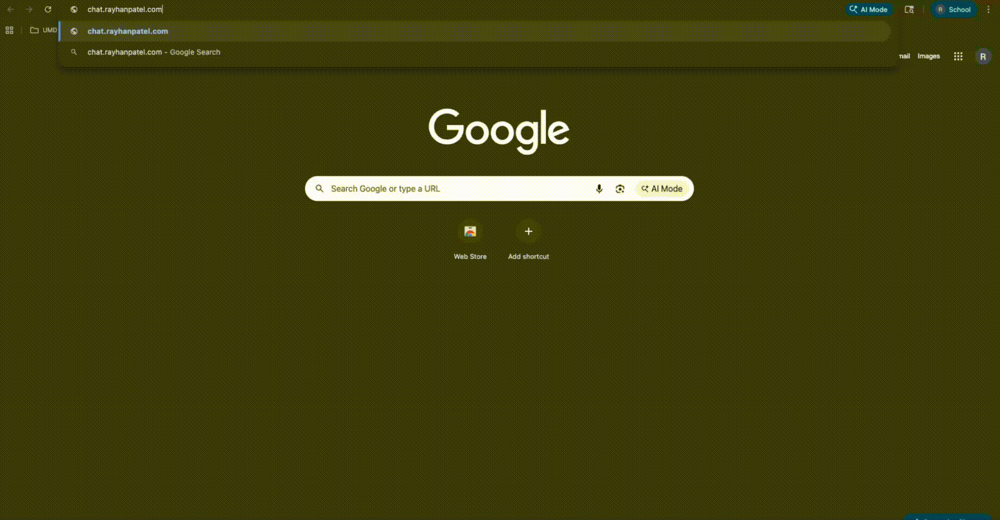
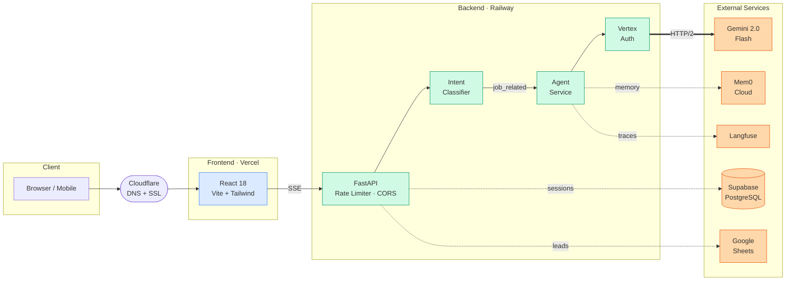
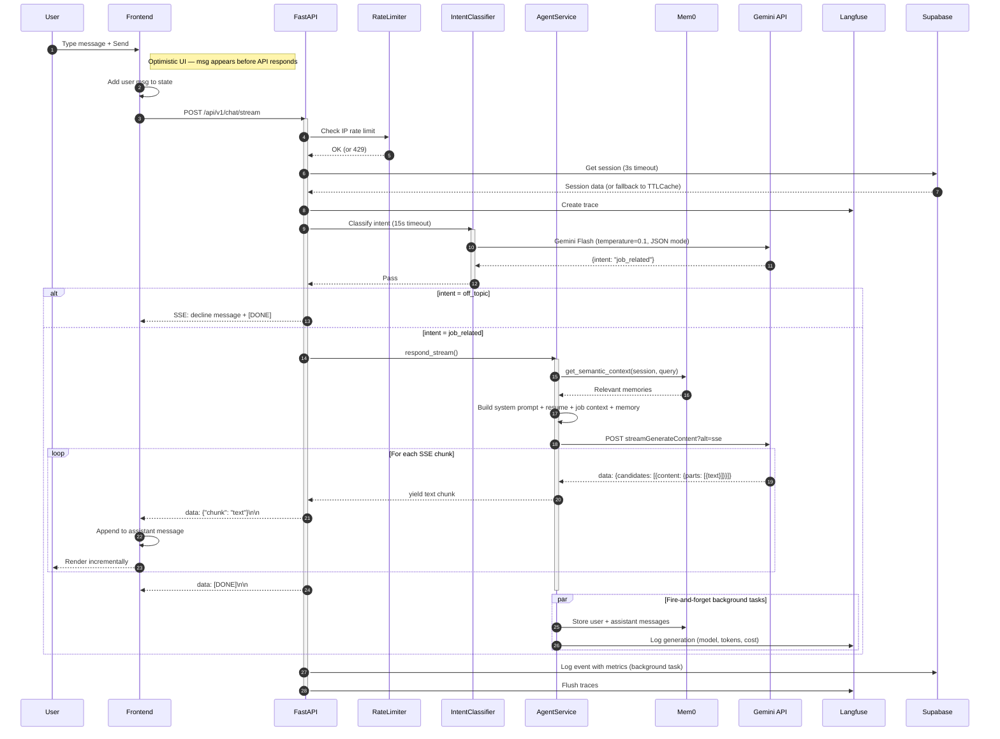
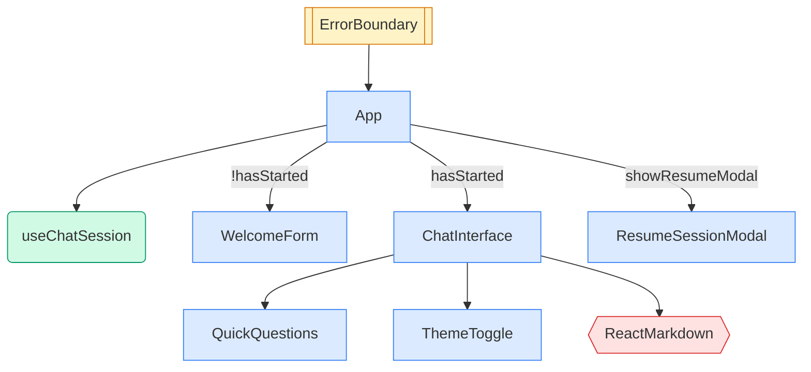
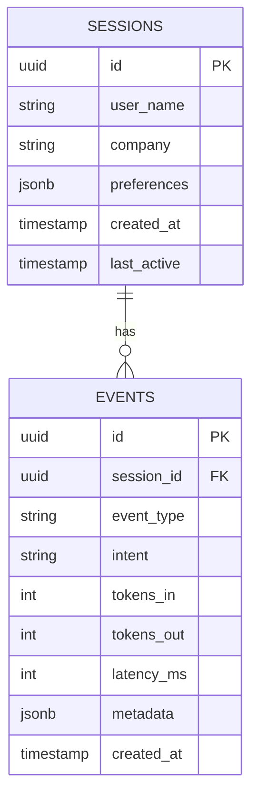

# AI Resume Chatbot

A production-grade conversational AI agent that answers recruiter questions about Rayhan Patel's professional background. Built with FastAPI, Google Gemini 2.0 Flash, and React 18. Uses raw HTTP calls to Gemini (no SDK), semantic memory via Mem0, real-time SSE streaming, and a full observability stack.

[](https://chat.rayhanpatel.com)
[](https://rayhan-ai-resume-production-6239.up.railway.app/api/v1/health)
[](https://github.com/Rayhanpatel/AI-Resume-Agent/actions)
[](LICENSE)

---

## Demo

<p align="center">
  
</p>

> **Try it live →** [chat.rayhanpatel.com](https://chat.rayhanpatel.com)

---

## Quick Start

### Prerequisites

- Python 3.11+
- Node.js 18+

### Setup

```bash
git clone https://github.com/Rayhanpatel/AI-Resume-Agent.git
cd AI-Resume-Agent
make setup
```

### Configure

Copy the example env file and fill in your API keys:

```bash
# Backend (required — only GOOGLE_API_KEY is needed to run)
cp backend/.env.example backend/.env
# Edit backend/.env and add your GOOGLE_API_KEY

# Frontend (optional — defaults to localhost:8000)
cp frontend/.env.example frontend/.env
```

See [Configuration Reference](#configuration-reference) for all variables.

### Run

```bash
# Terminal 1 — Backend (FastAPI on :8000)
make api

# Terminal 2 — Frontend (Vite on :5173)
make ui
```

The frontend proxies `/api` requests to the backend during development (configured in `vite.config.js`).

---

## Features

| Feature | Description | Implementation |
|---------|-------------|----------------|
| Real-time Streaming | Token-by-token response delivery | SSE with `X-Accel-Buffering: no` to bypass Cloudflare/nginx buffering |
| Dual LLM Fallback | Vertex AI (production) → AI Studio (free tier) | Automatic switchover in `vertex_auth.py` based on credential availability |
| Job URL Extraction | Paste LinkedIn/Greenhouse/Lever URLs | 8-layer SSRF-protected fetcher in `job_extractor.py` |
| LLM-Powered Job Parsing | Structured extraction from job postings | Gemini Flash with `responseMimeType: application/json` in `job_parser.py` |
| Dynamic Starter Prompts | Context-aware suggested questions | LLM-generated per job + hardcoded overrides for 8 companies (Google, Meta, Amazon, Apple, Microsoft, NVIDIA, OpenAI, Anthropic) |
| Semantic Memory | Cross-session conversational context | Mem0 Cloud API with vector search in `memory.py` |
| Intent Classification | Filters off-topic queries before LLM calls | Gemini Flash gate with fail-safe default to `job_related` |
| Prompt Injection Defense | Protects against embedded instructions in job descriptions | `<<<JOB_DESCRIPTION_START>>>` markers with explicit ignore instructions in `prompts.py` |
| Observability | Full LLM tracing with cost tracking | Langfuse SDK v3 with per-model pricing table in `tracer.py` |
| Rate Limiting | Per-IP sliding window throttle | Cloudflare-aware IP extraction (`CF-Connecting-IP` → `X-Forwarded-For`) |
| Session Persistence | Backend: Supabase PostgreSQL, Frontend: localStorage | 24h TTL, in-memory `TTLCache` fallback if DB is down |
| Session Resume | "Welcome back" modal for returning users | `localStorage` check on mount in `useChatSession.js` |
| Dark/Light Theme | Full theme toggle with OS preference detection | `ThemeToggle.jsx` + 150 lines of CSS overrides in `index.css` |
| Share Conversation | Copy full chat transcript to clipboard | `shareChat()` in `ChatInterface.jsx` with attribution link |
| Keyboard Shortcuts | `Cmd+K` focus input, `Escape` reset chat | Event listeners in `ChatInterface.jsx` + `useChatSession.js` |
| Lead Capture | Recruiter data sent to Google Sheets | Fire-and-forget webhook in `leads.py` |
| Accessibility | WCAG-compliant | `aria-live="polite"`, `role="dialog"`, `aria-modal`, `prefers-reduced-motion` |
| Error Recovery | Graceful crash handling | React `ErrorBoundary` (class component) with dev-only stack traces |
| SEO | Social sharing optimization | Open Graph + Twitter Card meta tags in `index.html` |
| Mobile Polish | iOS-specific fixes | `font-size: 16px` (prevents auto-zoom), `overscroll-behavior-y: none` |
| Graceful Degradation | Every external service fails silently | Each service has an `enabled` flag; if Mem0/Supabase/Langfuse is down, chat continues in ephemeral mode |
| Bot Protection | Smart CAPTCHA that challenges bots but passes humans | Cloudflare Turnstile (Managed Mode) in `WelcomeForm.jsx` + server-side validation in `session.py` (Fails open if Cloudflare is down) |
| Visitor Analytics | Privacy-friendly page view & visitor tracking | Vercel Analytics (`@vercel/analytics/react`) in `main.jsx` |
| Input Sanitization | HTML stripped from all user input before validation | `_strip_html()` regex runs via `@field_validator(mode="before")` across all Pydantic models |

---

## Architecture

The system follows a **Service-Oriented Architecture**: thin FastAPI route handlers delegate to rich domain services. Every external dependency (Mem0, Supabase, Langfuse) is wrapped in a service class that degrades gracefully if unavailable.


```mermaid
flowchart LR
    subgraph Client
        U["Browser / Mobile"]
    end

    CF(["Cloudflare<br/>DNS + SSL"])

    subgraph FE["Frontend · Vercel"]
        React["React 18<br/>Vite + Tailwind"]
    end

    subgraph BE["Backend · Railway"]
        API["FastAPI<br/>Rate Limiter · CORS"]
        IC["Intent<br/>Classifier"]
        Agent["Agent<br/>Service"]
        VA["Vertex<br/>Auth"]
    end

    subgraph Ext["External Services"]
        Gemini["Gemini 2.0<br/>Flash"]
        Mem0["Mem0<br/>Cloud"]
        LF["Langfuse"]
        Supa[("Supabase<br/>PostgreSQL")]
        Sheets["Google<br/>Sheets"]
    end

    U --> CF --> React
    React -->|"SSE"| API
    API --> IC -->|"job_related"| Agent --> VA
    VA ==>|"HTTP/2"| Gemini
    Agent -.->|"memory"| Mem0
    Agent -.->|"traces"| LF
    API -.->|"sessions"| Supa
    API -.->|"leads"| Sheets

    classDef ext fill:#fed7aa,stroke:#ea580c
    classDef be fill:#d1fae5,stroke:#059669
    classDef fe fill:#dbeafe,stroke:#3b82f6

    class Gemini,Mem0,LF,Supa,Sheets ext
    class API,IC,Agent,VA be
    class React fe
```

> **10 backend services**, **5 core modules**, and **4 API route groups** — see [Project Structure](#project-structure) for the complete inventory.

### Traffic Flow & Security

The system uses a **Split Architecture** optimization:

1. **Frontend (Static Assets)**: Served via **Vercel**, proxied through **Cloudflare**.
    - *Security*: Protected by Cloudflare WAF, DDoS mitigation, and SSL.
2. **Backend (API)**: Hosted on **Railway**, accessed directly by the Frontend (bypassing Cloudflare proxy).
    - *Reason*: Reduces latency for real-time SSE streaming and avoids Cloudflare timeout limits on long LLM generations.
    - *Security*: Because API traffic bypasses Cloudflare, the Backend implements its own robust defenses:
        - **Rate Limiting**: Custom middleware (`rate_limiter.py`) tracks IP reputation.
        - **Input Sanitization**: Pydantic validators (`schemas.py`) strip HTML from all inputs.
        - **Bot Detection**: Turnstile token validation (`session.py`) ensures requests originate from the legitimate frontend.

### Data Flow — Streaming Chat Request


```mermaid
sequenceDiagram
    autonumber
    participant U as User
    participant F as Frontend
    participant API as FastAPI
    participant RL as RateLimiter
    participant IC as IntentClassifier
    participant AG as AgentService
    participant M as Mem0
    participant G as Gemini API
    participant L as Langfuse
    participant S as Supabase

    U->>F: Type message + Send
    Note right of F: Optimistic UI — msg appears before API responds
    F->>F: Add user msg to state
    F->>API: POST /api/v1/chat/stream
    activate API

    API->>RL: Check IP rate limit
    RL-->>API: OK (or 429)

    API->>S: Get session (3s timeout)
    S-->>API: Session data (or fallback to TTLCache)

    API->>L: Create trace

    API->>IC: Classify intent (15s timeout)
    activate IC
    IC->>G: Gemini Flash (temperature=0.1, JSON mode)
    G-->>IC: {intent: "job_related"}
    IC-->>API: Pass
    deactivate IC

    alt intent = off_topic
        API-->>F: SSE: decline message + [DONE]
    else intent = job_related
        API->>AG: respond_stream()
        activate AG
        AG->>M: get_semantic_context(session, query)
        M-->>AG: Relevant memories
        AG->>AG: Build system prompt + resume + job context + memory
        AG->>G: POST streamGenerateContent?alt=sse

        loop For each SSE chunk
            G-->>AG: data: {candidates: [{content: {parts: [{text}]}}]}
            AG-->>API: yield text chunk
            API-->>F: data: {"chunk": "text"}\n\n
            F->>F: Append to assistant message
            F-->>U: Render incrementally
        end

        API-->>F: data: [DONE]\n\n
        deactivate AG

        par Fire-and-forget background tasks
            AG->>M: Store user + assistant messages
            AG->>L: Log generation (model, tokens, cost)
        end
    end

    API->>S: Log event with metrics (background task)
    API->>L: Flush traces
    deactivate API
```

### Frontend Component Tree


```mermaid
flowchart TB
    EB[["ErrorBoundary"]] --> App["App"]
    App --> Hook("useChatSession")
    App -->|"!hasStarted"| WF["WelcomeForm"]
    App -->|"hasStarted"| CI["ChatInterface"]
    App -->|"showResumeModal"| RSM["ResumeSessionModal"]
    CI --> QQ["QuickQuestions"]
    CI --> TT["ThemeToggle"]
    CI --> MD{{"ReactMarkdown"}}

    classDef component fill:#dbeafe,stroke:#3b82f6
    classDef hook fill:#d1fae5,stroke:#059669
    classDef boundary fill:#fef3c7,stroke:#d97706
    classDef library fill:#fee2e2,stroke:#dc2626

    class App,WF,CI,RSM,QQ,TT component
    class Hook hook
    class EB boundary
    class MD library
```

### Database Schema


```mermaid
erDiagram
    SESSIONS {
        uuid id PK
        string user_name
        string company
        jsonb preferences
        timestamp created_at
        timestamp last_active
    }

    EVENTS {
        uuid id PK
        uuid session_id FK
        string event_type
        string intent
        int tokens_in
        int tokens_out
        int latency_ms
        jsonb metadata
        timestamp created_at
    }

    SESSIONS ||--o{ EVENTS : has
```

---

## API Reference

| Endpoint | Method | Auth | Description |
|----------|--------|------|-------------|
| `/api/v1/health` | GET | None | Returns service status for all 6 subsystems |
| `/api/v1/session` | POST | None | Create session with optional job URL/text parsing |
| `/api/v1/chat` | POST | None | Non-streaming chat response |
| `/api/v1/chat/stream` | POST | None | SSE streaming chat response |
| `/api/v1/admin/analytics` | GET | `X-Admin-Key` | Aggregated usage stats over N days |
| `/api/v1/admin/sessions` | GET | `X-Admin-Key` | Recent sessions list |

---

## Configuration Reference

All variables loaded via Pydantic `BaseSettings` from `backend/.env`.

| Variable | Required | Description |
|----------|----------|-------------|
| `GOOGLE_API_KEY` | Yes | Gemini API key (AI Studio fallback) |
| `GOOGLE_CLOUD_PROJECT` | No | GCP project ID for Vertex AI |
| `GOOGLE_CLOUD_LOCATION` | No | GCP region (default: `us-central1`) |
| `GOOGLE_APPLICATION_CREDENTIALS_JSON` | No | Service account JSON for Vertex AI |
| `MEM0_API_KEY` | No | Mem0 Cloud API key (memory disabled if absent) |
| `ADMIN_API_KEY` | No | Secret key for `/admin` endpoints |
| `LANGFUSE_PUBLIC_KEY` | No | Langfuse public key (tracing disabled if absent) |
| `LANGFUSE_SECRET_KEY` | No | Langfuse secret key |
| `LANGFUSE_HOST` | No | Langfuse host URL |
| `SUPABASE_URL` | No | Supabase project URL (persistence disabled if absent) |
| `SUPABASE_KEY` | No | Supabase service role key |
| `GOOGLE_SHEET_WEBHOOK` | No | Google Apps Script webhook URL for lead capture |
| `TURNSTILE_SECRET_KEY` | No | Cloudflare Turnstile Secret Key (bot protection disabled if absent) |
| `FRONTEND_URL` | No | Frontend origin for CORS (default: `http://localhost:5173`) |
| `RATE_LIMIT_RPM` | No | Max requests per minute per IP (default: `10`) |
| `ENVIRONMENT` | No | `development` or `production` |

Only `GOOGLE_API_KEY` is required. All other services degrade gracefully when their keys are absent.

---

## Project Structure

```text
├── backend/
│   ├── api/
│   │   ├── deps.py                # Dependency injection (FastAPI Depends)
│   │   ├── router.py              # Route aggregation
│   │   └── routes/
│   │       ├── chat.py            # /chat and /chat/stream endpoints
│   │       ├── session.py         # /session endpoint
│   │       ├── admin.py           # /admin/* (auth-protected)
│   │       └── health.py          # /health endpoint
│   ├── core/
│   │   ├── config.py              # Pydantic BaseSettings
│   │   ├── prompts.py             # System prompt, resume, technical context
│   │   ├── ttl_cache.py           # Thread-safe TTL cache (OrderedDict + Lock)
│   │   ├── middleware.py          # Pure ASGI Request ID middleware
│   │   └── timeout.py            # Safe async timeout (asyncio.wait)
│   ├── infra/
│   │   └── schema.sql             # Supabase database schema
│   ├── middleware/
│   │   └── rate_limiter.py        # Per-IP sliding window rate limiter
│   ├── models/
│   │   └── schemas.py             # Pydantic v2 request/response models
│   ├── services/
│   │   ├── agent.py               # Core chat agent (streaming + non-streaming)
│   │   ├── intent.py              # Intent classifier (job_related/off_topic)
│   │   ├── vertex_auth.py         # Vertex AI OAuth2 + AI Studio fallback
│   │   ├── memory.py              # Mem0 semantic memory wrapper
│   │   ├── tracer.py              # Langfuse tracing + cost calculation
│   │   ├── supabase_service.py    # Async Supabase client (sessions + events)
│   │   ├── job_extractor.py       # SSRF-protected URL fetcher
│   │   ├── job_parser.py          # LLM-powered job description parser
│   │   ├── prompt_generator.py    # Dynamic starter question generator
│   │   └── leads.py               # Google Sheets lead capture
│   ├── main.py                    # FastAPI app, lifespan manager, CORS
│   ├── Dockerfile                 # python:3.11-slim container
│   ├── start.sh                   # Uvicorn entrypoint (exec, h11, PORT var)
│   ├── railway.json               # Railway deploy config (healthcheck, restart)
│   ├── requirements.txt           # Pinned Python dependencies
│   └── .env.example               # Environment variable reference
├── frontend/
│   ├── src/
│   │   ├── components/
│   │   │   ├── ChatInterface.jsx  # Main chat UI (memo-wrapped)
│   │   │   ├── WelcomeForm.jsx    # Entry form (name, company, job)
│   │   │   ├── QuickQuestions.jsx  # Suggested prompts (memo-wrapped)
│   │   │   ├── ResumeSessionModal.jsx  # Session resume dialog
│   │   │   ├── ThemeToggle.jsx    # Dark/light toggle (memo-wrapped)
│   │   │   └── ErrorBoundary.jsx  # React error boundary
│   │   ├── hooks/
│   │   │   └── useChatSession.js  # All business logic (300+ lines)
│   │   ├── App.jsx                # Thin UI wrapper
│   │   ├── main.jsx               # React root (StrictMode + ErrorBoundary)
│   │   └── index.css              # Design system (480+ lines)
│   ├── index.html                 # SEO meta, OG tags, loading spinner
│   ├── vite.config.js             # Dev proxy, build config
│   ├── tailwind.config.js         # Custom palette + animations
│   └── package.json               # React 18, lucide, react-markdown
├── .github/
│   └── workflows/
│       └── ci.yml                 # Backend import check + Frontend build (2 jobs)
├── Makefile                       # setup, api, ui, build, clean
└── README.md
```

---

## Design Decisions

### Raw HTTP instead of Google GenAI SDK

The official `google-genai` Python SDK uses a synchronous transport internally, which causes blocking I/O and threading issues when used with `asyncio`. We replaced it with direct `httpx` HTTP/2 calls to the Gemini REST API. This gives us full async support, connection pooling (20 keepalive, 100 max), and explicit control over timeouts and retries.

### `asyncio.wait()` instead of `asyncio.wait_for()`

`asyncio.wait_for()` calls `task.cancel()` and then `await`s the cancellation. If the underlying coroutine doesn't handle `CancelledError` (e.g., `supabase-py`), `wait_for` hangs indefinitely. Our `safe_timeout()` uses `asyncio.wait()` with a timeout parameter — if the task doesn't complete, we cancel it **without awaiting** and return a default value.

### Thread-safe TTLCache with deadlock prevention

The `TTLCache` extends `OrderedDict` and wraps all public methods with `threading.Lock`. Internal operations use `super().__delitem__()` and `super().__setitem__()` to bypass the overridden methods that would attempt to re-acquire the lock, preventing deadlocks.

### Pure ASGI middleware instead of BaseHTTPMiddleware

Starlette's `BaseHTTPMiddleware` has a known issue where it can hang when reading the request body in certain conditions. Our `RequestIDMiddleware` operates at the raw ASGI level, intercepting the `send` callable directly, which avoids this class of bugs entirely.

### Optimistic UI + fire-and-forget

User messages appear in the chat instantly before the API responds (optimistic rendering). Non-critical background operations (memory storage, event logging, lead capture) use `asyncio.create_task()` so they never block the response stream.

### Intent classification as a gate

Off-topic queries are classified and declined *before* the expensive agent call. The classifier uses Gemini Flash (cheapest model) with `temperature=0.1` for deterministic output and defaults to `job_related` on any failure, ensuring users are never incorrectly blocked.

### Graceful degradation via service flags

Every external service wrapper (`MemoryService`, `SupabaseService`, `TracingService`) carries an `enabled` boolean set during initialization. If credentials are missing or the initial connection fails, `enabled` is set to `False` and all methods become no-ops returning safe defaults (`None`, `[]`, `False`). This means the chat always works — even if every external service is down, the agent still responds using only Gemini + the system prompt.

### Input sanitization before type validation

All string fields in Pydantic request models run through `_strip_html()` (a regex that removes all HTML tags) via `@field_validator(mode="before")`. This runs *before* Pydantic's type coercion, so malicious HTML never reaches business logic. The admin auth endpoint uses `secrets.compare_digest()` for constant-time key comparison, preventing timing-based attacks.

---

## Deployment

| Component | Platform | Config |
|-----------|----------|--------|
| Backend | Railway | `Dockerfile` → `python:3.11-slim`, `start.sh` runs uvicorn with `$PORT`, restart on failure (10 retries), health check at `/api/v1/health` |
| Frontend | Vercel | Auto-deploy from `main` branch, custom domain `chat.rayhanpatel.com` |
| CDN | Cloudflare | DNS + SSL + Proxy, SSE buffering bypassed via response headers |
| CI | GitHub Actions | 2-job pipeline: backend (Python 3.11, install deps, verify imports) + frontend (Node 18, `npm ci`, `npm run build`) on push/PR to `main` |

### Custom Domain

- **Frontend**: `chat.rayhanpatel.com` → CNAME to `cname.vercel-dns.com`
- **Backend**: CORS allowed origins in `main.py` include the custom domain and Vercel preview URLs
- **Cloudflare**: Proxy enabled (orange cloud), SSE buffering bypassed by backend `X-Accel-Buffering: no` header

---

## Tech Stack

### Backend

| Dependency | Version | Purpose |
|------------|---------|---------|
| FastAPI | ≥0.115 | Web framework |
| uvicorn | ≥0.34 | ASGI server |
| httpx | ≥0.28 | HTTP/2 client for Gemini API |
| pydantic | ≥2.10 | Request/response validation + input sanitization |
| pydantic-settings | ≥2.7 | Environment variable loading |
| mem0ai | ≥1.0.2 | Semantic memory API client |
| langfuse | ≥3.12 | LLM observability SDK |
| supabase | ≥2.27 | Async PostgreSQL client |
| tenacity | ≥8.2 | Retry with exponential backoff |
| google-auth | ≥2.27 | Vertex AI OAuth2 token management |

### Frontend

| Dependency | Version | Purpose |
|------------|---------|---------|
| React | 18.3 | UI framework |
| Vite | 5.4 | Build tool + dev server |
| TailwindCSS | 3.4 | Utility-first CSS |
| lucide-react | 0.469 | Icon library |
| react-markdown | 10.1 | Markdown rendering in chat bubbles |
| remark-gfm | 4.0 | GitHub Flavored Markdown support |

---

## Author

**Rayhan Patel** — MS Applied Machine Learning @ University of Maryland

[](https://rayhanpatel.com)
[](https://linkedin.com/in/rayhan-patel-cs)
[](mailto:rayhanbp@umd.edu)

---

## License

MIT — see [LICENSE](LICENSE) for details.
