# AI Resume Chatbot

A conversational AI agent that answers recruiter questions about Rayhan Patel's professional background — built with observability, security, and graceful degradation in mind. FastAPI, Google Gemini 2.0 Flash, and React 18. Raw HTTP calls to Gemini (no SDK), semantic memory via Mem0, real-time SSE streaming, and automated LLM-as-a-Judge evaluation.

[](https://chat.rayhanpatel.com)
[](https://rayhan-ai-resume-production-6239.up.railway.app/api/v1/health)
[](https://github.com/Rayhanpatel/AI-Resume-Agent/actions)
[](LICENSE)

---

## Demo

<p align="center">
  
</p>

> 🎬 **[Watch the full architecture walkthrough](https://youtu.be/5xGjCrDEoMQ)** · **[Try it live →](https://chat.rayhanpatel.com)**

---

## Quick Start

### Prerequisites

- Python 3.11+
- Node.js 18+

### Setup

```bash
git clone https://github.com/Rayhanpatel/AI-Resume-Agent.git
cd AI-Resume-Agent
make setup
```

### Configure

Copy the example env file and fill in your API keys:

```bash
# Backend (required — only GOOGLE_API_KEY is needed to run)
cp backend/.env.example backend/.env
# Edit backend/.env and add your GOOGLE_API_KEY

# Frontend (optional — defaults to localhost:8000)
cp frontend/.env.example frontend/.env
```

See [Configuration Reference](#configuration-reference) for all variables.

### Run

```bash
# Terminal 1 — Backend (FastAPI on :8000)
make api

# Terminal 2 — Frontend (Vite on :5173)
make ui
```

The frontend proxies `/api` requests to the backend during development (configured in `vite.config.js`).

---

## Features

| Feature | Description | Implementation |
|---------|-------------|----------------|
| Real-time Streaming | Token-by-token response delivery | SSE with `X-Accel-Buffering: no` to bypass Cloudflare/nginx buffering |
| Dual LLM Fallback | Vertex AI (production) → AI Studio (free tier) | Automatic switchover in `vertex_auth.py` based on credential availability |
| Job URL Extraction | Paste LinkedIn/Greenhouse/Lever URLs | 8-layer SSRF-protected fetcher in `job_extractor.py` |
| LLM-Powered Job Parsing | Structured extraction from job postings | Gemini Flash with `responseMimeType: application/json` in `job_parser.py` |
| Dynamic Starter Prompts | Context-aware suggested questions | LLM-generated per job description with generic fallback defaults in `prompt_generator.py` |
| Semantic Memory | Cross-session conversational context | Mem0 Cloud API with vector search in `memory.py` |
| Intent Classification | Filters off-topic queries before LLM calls | Gemini Flash gate with fail-safe default to `job_related` |
| Prompt Injection Defense | Protects against embedded instructions in job descriptions | `<<<JOB_DESCRIPTION_START>>>` markers with explicit ignore instructions in `prompts.py` |
| Observability | Full LLM tracing, cost tracking, and automated quality evaluation | Langfuse SDK v3 with per-model pricing in `tracer.py` + 5 LLM-as-a-Judge evaluators (Hallucination, Relevance, Conciseness, Helpfulness, Toxicity) via Gemini 2.5 Flash |
| Rate Limiting | Per-IP sliding window throttle | Cloudflare-aware IP extraction (`CF-Connecting-IP` → `X-Forwarded-For`) |
| Session Persistence | Backend: Supabase PostgreSQL, Frontend: localStorage | 24h TTL, in-memory `TTLCache` fallback if DB is down |
| Session Resume | "Welcome back" modal for returning users | `localStorage` check on mount in `useChatSession.js` |
| Dark/Light Theme | Full theme toggle with OS preference detection | `ThemeToggle.jsx` + 150 lines of CSS overrides in `index.css` |
| Share Conversation | Copy full chat transcript to clipboard | `shareChat()` in `ChatInterface.jsx` with attribution link |
| Keyboard Shortcuts | `Cmd+K` focus input, `Escape` reset chat | Event listeners in `ChatInterface.jsx` + `useChatSession.js` |
| Lead Capture | Recruiter data sent to Google Sheets | Fire-and-forget webhook in `leads.py` |
| Accessibility | WCAG-compliant | `aria-live="polite"`, `role="dialog"`, `aria-modal`, `prefers-reduced-motion` |
| Error Recovery | Graceful crash handling | React `ErrorBoundary` (class component) with dev-only stack traces |
| SEO | Social sharing optimization | Open Graph + Twitter Card meta tags in `index.html` |
| Mobile Polish | iOS-specific fixes | `font-size: 16px` (prevents auto-zoom), `overscroll-behavior-y: none` |
| Graceful Degradation | Every external service fails silently | Each service has an `enabled` flag; if Mem0/Supabase/Langfuse is down, chat continues in ephemeral mode |
| Bot Protection | Smart CAPTCHA that challenges bots but passes humans | Cloudflare Turnstile (Managed Mode) in `WelcomeForm.jsx` + server-side validation in `session.py` (Fails open if Cloudflare is down) |
| Visitor Analytics | Privacy-friendly page view & visitor tracking | Vercel Analytics (`@vercel/analytics/react`) in `main.jsx` |
| Performance Monitoring | Real User Metrics (Core Web Vitals) | Vercel Speed Insights (`@vercel/speed-insights/react`) in `main.jsx` |
| Input Sanitization | HTML stripped from all user input before validation | `_strip_html()` regex runs via `@field_validator(mode="before")` across all Pydantic models |

---

## Architecture

The system follows a **Service-Oriented Architecture**: thin FastAPI route handlers delegate to rich domain services. Every external dependency (Mem0, Supabase, Langfuse) is wrapped in a service class that degrades gracefully if unavailable.

```mermaid
flowchart LR
    subgraph Client
        U["Browser / Mobile"]
    end

    CF(["Cloudflare<br/>DNS + SSL"])

    subgraph FE["Frontend · Vercel"]
        React["React 18<br/>Vite + Tailwind"]
    end

    subgraph BE["Backend · Railway"]
        API["FastAPI<br/>Rate Limiter · CORS"]
        IC["Intent<br/>Classifier"]
        Agent["Agent<br/>Service"]
        VA["Vertex<br/>Auth"]
    end

    subgraph Ext["External Services"]
        Gemini["Gemini 2.0<br/>Flash"]
        Mem0["Mem0<br/>Cloud"]
        LF["Langfuse<br/>+ Evaluators"]
        Supa[("Supabase<br/>PostgreSQL")]
        Sheets["Google<br/>Sheets"]
        Turn(["Cloudflare<br/>Turnstile"])
    end

    U --> CF --> React
    React -->|"SSE"| API
    API --> IC -->|"job_related"| Agent --> VA
    VA ==>|"HTTP/2"| Gemini
    Agent -.->|"memory"| Mem0
    Agent -.->|"traces"| LF
    API -.->|"sessions"| Supa
    API -.->|"leads"| Sheets
    API -.->|"bot check"| Turn

    classDef ext fill:#fed7aa,stroke:#ea580c
    classDef be fill:#d1fae5,stroke:#059669
    classDef fe fill:#dbeafe,stroke:#3b82f6

    class Gemini,Mem0,LF,Supa,Sheets,Turn ext
    class API,IC,Agent,VA be
    class React fe
```



> **10 backend services**, **5 core modules**, and **4 API route groups** — see [Project Structure](#project-structure) for the complete inventory.

### Traffic Flow & Security

The system uses a **Split Architecture** optimization:

1. **Frontend (Static Assets)**: Served via **Vercel**, proxied through **Cloudflare**.
    - *Security*: Protected by Cloudflare WAF, DDoS mitigation, and SSL.
2. **Backend (API)**: Hosted on **Railway**, accessed directly by the Frontend (bypassing Cloudflare proxy).
    - *Reason*: Reduces latency for real-time SSE streaming and avoids Cloudflare timeout limits on long LLM generations.
    - *Security*: Because API traffic bypasses Cloudflare, the Backend implements its own robust defenses:
        - **Rate Limiting**: Custom middleware (`rate_limiter.py`) tracks IP reputation.
        - **Input Sanitization**: Pydantic validators (`schemas.py`) strip HTML from all inputs.
        - **Bot Detection**: Turnstile token validation (`session.py`) ensures requests originate from the legitimate frontend.

### Data Flow — Streaming Chat Request

```mermaid
sequenceDiagram
    autonumber
    participant U as User
    participant F as Frontend
    participant API as FastAPI
    participant RL as RateLimiter
    participant IC as IntentClassifier
    participant AG as AgentService
    participant M as Mem0
    participant G as Gemini API
    participant L as Langfuse
    participant S as Supabase

    U->>F: Type message + Send
    Note right of F: Optimistic UI — msg appears before API responds
    F->>F: Add user msg to state
    F->>API: POST /api/v1/chat/stream
    activate API

    API->>RL: Check IP rate limit
    RL-->>API: OK (or 429)

    API->>S: Get session (3s timeout)
    S-->>API: Session data (or fallback to TTLCache)

    API->>L: Create trace

    API->>IC: Classify intent (10s timeout)
    activate IC
    IC->>G: Gemini Flash (temperature=0.1, JSON mode)
    G-->>IC: {intent: "job_related"}
    IC-->>API: Pass
    deactivate IC

    alt intent = off_topic
        API-->>F: SSE: decline message + [DONE]
    else intent = job_related
        API->>AG: respond_stream()
        activate AG
        AG->>M: get_semantic_context(session, query)
        M-->>AG: Relevant memories
        AG->>AG: Build system prompt + resume + job context + memory
        AG->>G: POST streamGenerateContent?alt=sse

        loop For each SSE chunk
            G-->>AG: data: {candidates: [{content: {parts: [{text}]}}]}
            AG-->>API: yield text chunk
            API-->>F: data: {"chunk": "text"}\n\n
            F->>F: Append to assistant message
            F-->>U: Render incrementally
        end

        API-->>F: data: [DONE]\n\n
        deactivate AG

        par Fire-and-forget background tasks
            AG->>M: Store user + assistant messages
            AG->>L: Log generation (model, tokens, cost)
        end
    end

    API->>S: Log event with metrics (background task)
    API->>L: Flush traces
    deactivate API

    Note over L: Async (server-side)
    L->>L: Run 5 LLM-as-a-Judge evaluators
    Note over L: Hallucination · Relevance · Conciseness<br/>Helpfulness · Toxicity
```



### Frontend Component Tree


### Database Schema


---

## API Reference

| Endpoint | Method | Auth | Description |
|----------|--------|------|-------------|
| `/api/v1/health` | GET | None | Returns service status for all 6 subsystems |
| `/api/v1/session` | POST | None | Create session with optional job URL/text parsing |
| `/api/v1/chat` | POST | None | Non-streaming chat response |
| `/api/v1/chat/stream` | POST | None | SSE streaming chat response |
| `/api/v1/admin/analytics` | GET | `X-Admin-Key` | Aggregated usage stats over N days |
| `/api/v1/admin/sessions` | GET | `X-Admin-Key` | Recent sessions list |

---

## Configuration Reference

All variables loaded via Pydantic `BaseSettings` from `backend/.env`.

| Variable | Required | Description |
|----------|----------|-------------|
| `GOOGLE_API_KEY` | Yes | Gemini API key (AI Studio fallback) |
| `GOOGLE_CLOUD_PROJECT` | No | GCP project ID for Vertex AI |
| `GOOGLE_CLOUD_LOCATION` | No | GCP region (default: `us-central1`) |
| `GOOGLE_APPLICATION_CREDENTIALS_JSON` | No | Service account JSON for Vertex AI |
| `MEM0_API_KEY` | No | Mem0 Cloud API key (memory disabled if absent) |
| `ADMIN_API_KEY` | No | Secret key for `/admin` endpoints |
| `LANGFUSE_PUBLIC_KEY` | No | Langfuse public key (tracing disabled if absent) |
| `LANGFUSE_SECRET_KEY` | No | Langfuse secret key |
| `LANGFUSE_HOST` | No | Langfuse host URL |
| `SUPABASE_URL` | No | Supabase project URL (persistence disabled if absent) |
| `SUPABASE_KEY` | No | Supabase service role key |
| `GOOGLE_SHEET_WEBHOOK` | No | Google Apps Script webhook URL for lead capture |
| `TURNSTILE_SECRET_KEY` | No | Cloudflare Turnstile Secret Key (bot protection disabled if absent) |
| `FRONTEND_URL` | No | Frontend origin for CORS (default: `http://localhost:5173`) |
| `RATE_LIMIT_RPM` | No | Max requests per minute per IP (default: `10`) |
| `ENVIRONMENT` | No | `development` or `production` |

Only `GOOGLE_API_KEY` is required. All other services degrade gracefully when their keys are absent.

---

## Project Structure

```text
├── backend/
│   ├── api/
│   │   ├── deps.py                # Dependency injection (FastAPI Depends)
│   │   ├── router.py              # Route aggregation
│   │   └── routes/
│   │       ├── chat.py            # /chat and /chat/stream endpoints
│   │       ├── session.py         # /session endpoint
│   │       ├── admin.py           # /admin/* (auth-protected)
│   │       └── health.py          # /health endpoint
│   ├── core/
│   │   ├── config.py              # Pydantic BaseSettings
│   │   ├── prompts.py             # System prompt, resume, technical context
│   │   ├── ttl_cache.py           # Thread-safe TTL cache (OrderedDict + Lock)
│   │   ├── middleware.py          # Pure ASGI Request ID middleware
│   │   └── timeout.py            # Safe async timeout (asyncio.wait)
│   ├── infra/
│   │   └── schema.sql             # Supabase database schema
│   ├── middleware/
│   │   └── rate_limiter.py        # Per-IP sliding window rate limiter
│   ├── models/
│   │   └── schemas.py             # Pydantic v2 request/response models
│   ├── services/
│   │   ├── agent.py               # Core chat agent (streaming + non-streaming)
│   │   ├── intent.py              # Intent classifier (job_related/off_topic)
│   │   ├── vertex_auth.py         # Vertex AI OAuth2 + AI Studio fallback
│   │   ├── memory.py              # Mem0 semantic memory wrapper
│   │   ├── tracer.py              # Langfuse tracing + cost calculation + evaluator integration
│   │   ├── supabase_service.py    # Async Supabase client (sessions + events)
│   │   ├── job_extractor.py       # SSRF-protected URL fetcher
│   │   ├── job_parser.py          # LLM-powered job description parser
│   │   ├── prompt_generator.py    # Dynamic starter question generator
│   │   └── leads.py               # Google Sheets lead capture
│   ├── main.py                    # FastAPI app, lifespan manager, CORS
│   ├── Dockerfile                 # python:3.11-slim container
│   ├── start.sh                   # Uvicorn entrypoint (exec, h11, PORT var)
│   ├── railway.json               # Railway deploy config (healthcheck, restart)
│   ├── requirements.txt           # Pinned Python dependencies
│   └── .env.example               # Environment variable reference
├── frontend/
│   ├── src/
│   │   ├── components/
│   │   │   ├── ChatInterface.jsx  # Main chat UI (memo-wrapped)
│   │   │   ├── WelcomeForm.jsx    # Entry form (name, company, job)
│   │   │   ├── QuickQuestions.jsx  # Suggested prompts (memo-wrapped)
│   │   │   ├── ResumeSessionModal.jsx  # Session resume dialog
│   │   │   ├── ThemeToggle.jsx    # Dark/light toggle (memo-wrapped)
│   │   │   └── ErrorBoundary.jsx  # React error boundary
│   │   ├── hooks/
│   │   │   └── useChatSession.js  # All business logic (300+ lines)
│   │   ├── App.jsx                # Thin UI wrapper
│   │   ├── main.jsx               # React root (StrictMode + ErrorBoundary)
│   │   └── index.css              # Design system (480+ lines)
│   ├── index.html                 # SEO meta, OG tags, loading spinner
│   ├── vite.config.js             # Dev proxy, build config
│   ├── tailwind.config.js         # Custom palette + animations
│   └── package.json               # React 18, lucide, react-markdown
├── .github/
│   └── workflows/
│       └── ci.yml                 # Backend import check + Frontend build (2 jobs)
├── Makefile                       # setup, api, ui, build, clean
└── README.md
```

---

## Design Decisions

### Raw HTTP instead of Google GenAI SDK

The official `google-genai` Python SDK uses a synchronous transport internally, which causes blocking I/O and threading issues when used with `asyncio`. We replaced it with direct `httpx` HTTP/2 calls to the Gemini REST API. This gives us full async support, connection pooling (20 keepalive, 100 max), and explicit control over timeouts and retries.

### `asyncio.wait()` instead of `asyncio.wait_for()`

`asyncio.wait_for()` calls `task.cancel()` and then `await`s the cancellation. If the underlying coroutine doesn't handle `CancelledError` (e.g., `supabase-py`), `wait_for` hangs indefinitely. Our `safe_timeout()` uses `asyncio.wait()` with a timeout parameter — if the task doesn't complete, we cancel it **without awaiting** and return a default value.

### Thread-safe TTLCache with deadlock prevention

The `TTLCache` extends `OrderedDict` and wraps all public methods with `threading.Lock`. Internal operations use `super().__delitem__()` and `super().__setitem__()` to bypass the overridden methods that would attempt to re-acquire the lock, preventing deadlocks.

### Pure ASGI middleware instead of BaseHTTPMiddleware

Starlette's `BaseHTTPMiddleware` has a known issue where it can hang when reading the request body in certain conditions. Our `RequestIDMiddleware` operates at the raw ASGI level, intercepting the `send` callable directly, which avoids this class of bugs entirely.

### Optimistic UI + fire-and-forget

User messages appear in the chat instantly before the API responds (optimistic rendering). Non-critical background operations (memory storage, event logging, lead capture) use `asyncio.create_task()` so they never block the response stream.

### Intent classification as a gate

Off-topic queries are classified and declined *before* the expensive agent call. The classifier uses Gemini Flash (cheapest model) with `temperature=0.1` for deterministic output and defaults to `job_related` on any failure, ensuring users are never incorrectly blocked.

### Graceful degradation via service flags

Every external service wrapper (`MemoryService`, `SupabaseService`, `TracingService`) carries an `enabled` boolean set during initialization. If credentials are missing or the initial connection fails, `enabled` is set to `False` and all methods become no-ops returning safe defaults (`None`, `[]`, `False`). This means the chat always works — even if every external service is down, the agent still responds using only Gemini + the system prompt.

### Input sanitization before type validation

All string fields in Pydantic request models run through `_strip_html()` (a regex that removes all HTML tags) via `@field_validator(mode="before")`. This runs *before* Pydantic's type coercion, so malicious HTML never reaches business logic. The admin auth endpoint uses `secrets.compare_digest()` for constant-time key comparison, preventing timing-based attacks.

### LLM-as-a-Judge over rule-based evaluation

Traditional metrics (BLEU, ROUGE) measure surface-level text overlap and fail on open-ended conversational responses. We use Langfuse's LLM-as-a-Judge evaluators with Gemini 2.5 Flash scoring every trace across 5 dimensions (Hallucination, Relevance, Conciseness, Helpfulness, Toxicity). This runs server-side in Langfuse at 100% sampling — zero backend code changes, zero latency impact on users, and the evaluation model is different from the generation model to avoid self-bias.

---

## Deployment

| Component | Platform | Config |
|-----------|----------|--------|
| Backend | Railway | `Dockerfile` → `python:3.11-slim`, `start.sh` runs uvicorn with `$PORT`, restart on failure (10 retries), health check at `/api/v1/health` |
| Frontend | Vercel | Auto-deploy from `main` branch, custom domain `chat.rayhanpatel.com` |
| CDN | Cloudflare | DNS + SSL + Proxy, SSE buffering bypassed via response headers |
| CI | GitHub Actions | 2-job pipeline: backend (Python 3.11, install deps, verify imports) + frontend (Node 18, `npm ci`, `npm run build`) on push/PR to `main` |

### Custom Domain

- **Frontend**: `chat.rayhanpatel.com` → CNAME to `cname.vercel-dns.com`
- **Backend**: CORS allowed origins in `main.py` include the custom domain and Vercel preview URLs
- **Cloudflare**: Proxy enabled (orange cloud), SSE buffering bypassed by backend `X-Accel-Buffering: no` header

---

## Tech Stack

### Backend

| Dependency | Version | Purpose |
|------------|---------|---------|
| FastAPI | ≥0.115 | Web framework |
| uvicorn | ≥0.34 | ASGI server |
| httpx | ≥0.28 | HTTP/2 client for Gemini API |
| pydantic | ≥2.10 | Request/response validation + input sanitization |
| pydantic-settings | ≥2.7 | Environment variable loading |
| mem0ai | ≥1.0.2 | Semantic memory API client |
| langfuse | ≥3.12 | LLM observability + LLM-as-a-Judge evaluation |
| supabase | ≥2.27 | Async PostgreSQL client |
| tenacity | ≥8.2 | Retry with exponential backoff |
| google-auth | ≥2.27 | Vertex AI OAuth2 token management |

### Frontend

| Dependency | Version | Purpose |
|------------|---------|---------|
| React | 18.3 | UI framework |
| Vite | 5.4 | Build tool + dev server |
| TailwindCSS | 3.4 | Utility-first CSS |
| lucide-react | 0.469 | Icon library |
| react-markdown | 10.1 | Markdown rendering in chat bubbles |
| remark-gfm | 4.0 | GitHub Flavored Markdown support |

---

## Author

**Rayhan Patel** — MS Applied Machine Learning @ University of Maryland

[](https://rayhanpatel.com)
[](https://linkedin.com/in/rayhan-patel-cs)
[](mailto:rayhanbp@umd.edu)

---

## License

MIT — see [LICENSE](LICENSE) for details.
